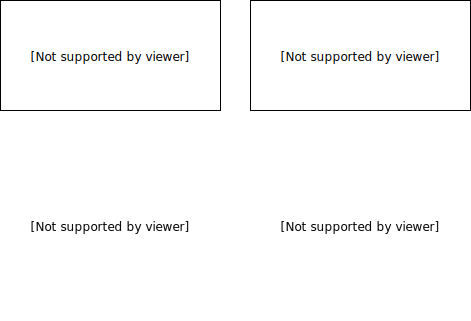

# secure-chip

&nbsp;&nbsp;&nbsp;Что такое secure-chip? Это аппартный DRM микроконтроллер, который позволяет исполнять отдельные функции программы, запущенной на компьютере пользователя, без его доступа к исполняемым файлам. При покупке ПО, пользователь указывает уникальный ID своего secure-chip, который отправляется на SCS (Secure Chip Servers), вместе со сгенерированным продавцом ключом активации ПО.

&nbsp;&nbsp;&nbsp;Теперь, в базе данных SCS, данному ID соответствует его заводской ключ, а так-же новое ПО и уникальный ключ этого ПО (действительный только для данного (ID). Что-бы запустить функцию, пользователь посылает в secure-chip: ключ активации, адрес сервера и входные данные для нее. Secure-chip проверяет цифровую подпись сервера и подключается к нему используя компьютер хоста, как устройство для доступа в интернет (по HTTPS, чтобы избежать man-in-middle аттак). Secure-chip отправляет на сервер свой ID, заводской ключ и ключ активации. SCS шифрует скомпилированный под архитектуру микроконтроллера бинарный файл (используя заводской ключ) и отправляет его чипу. Затем, secure-chip расшифровывает бинарный файл в своей оперативной памяти и исполняет его со входными данными (на входные данные накладываются ограничения, чтобы избежать переполнения буффера и атак на secure-chip). Выходные данные отправляются хосту.

&nbsp;&nbsp;&nbsp;Чем это лучше исполнения кода на сервере? Исполняя код на сервере, 2 человека могут пользоваться одним кодом активации (а для каждого secure-chip, есть свой ключ активации (1), свой ID и заводской ключ (2) ). Плюс secure-chip может использоваться удаленно, полсе скачивания исполняемого файла.

# Cool Visualization!

